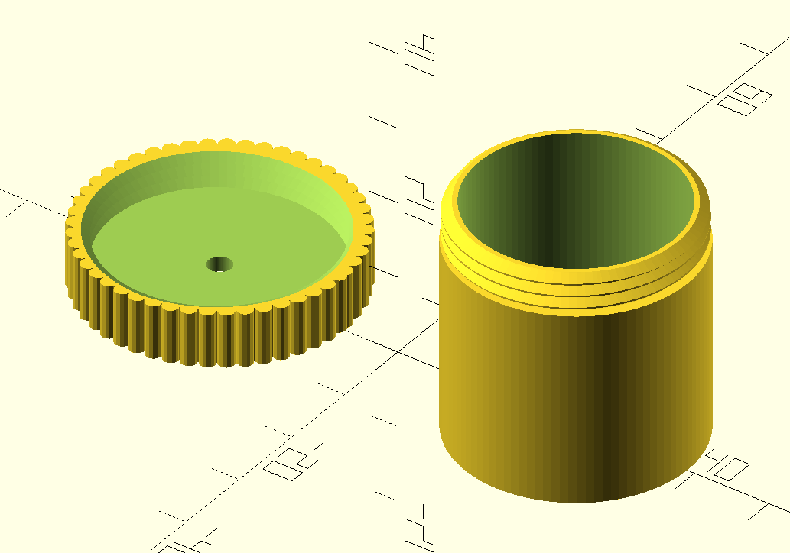

# Parametric threaded box

A tube box with a cap. You can screw the cap on the box. Quite simple concept.

In openscad, you can choose the size of the box.

There are also some options:

- adding grip on the cap;
- adding holes on the bottom of the box and/or on the cap.

I print my boxes with 0.2 layer height. The threads are ok.

No support needed.
